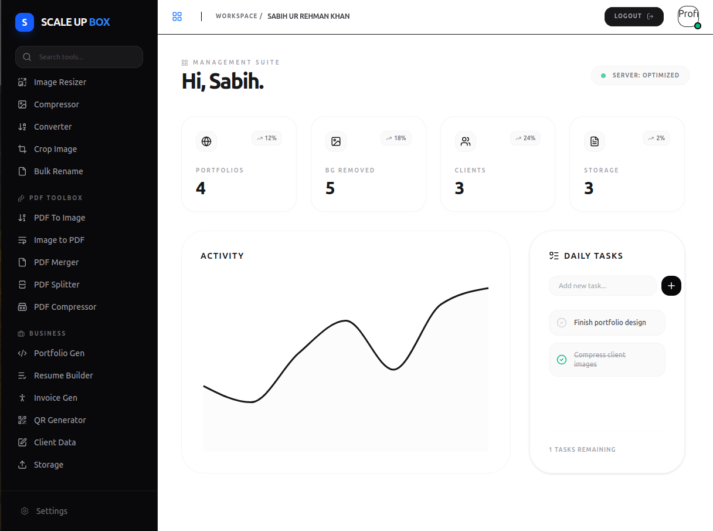
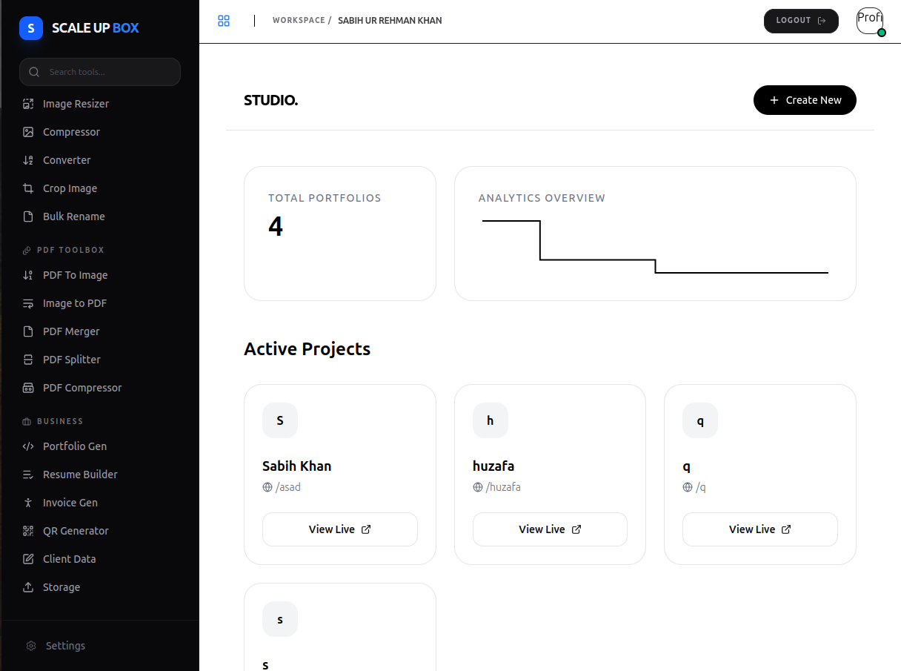
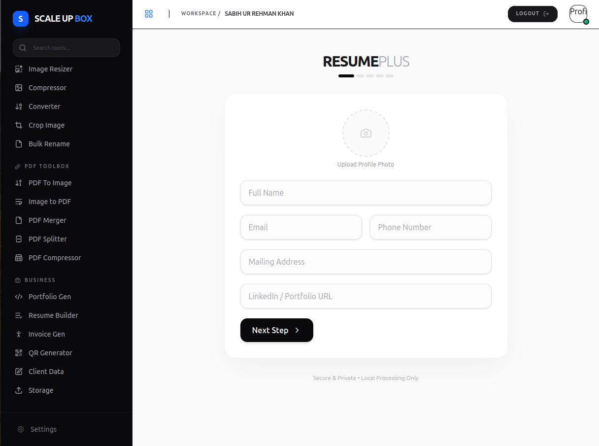
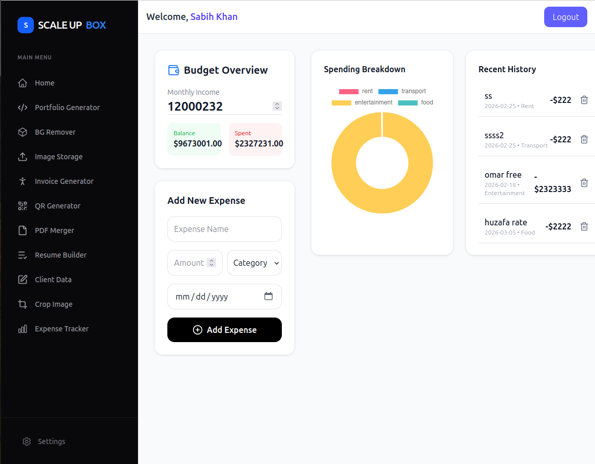
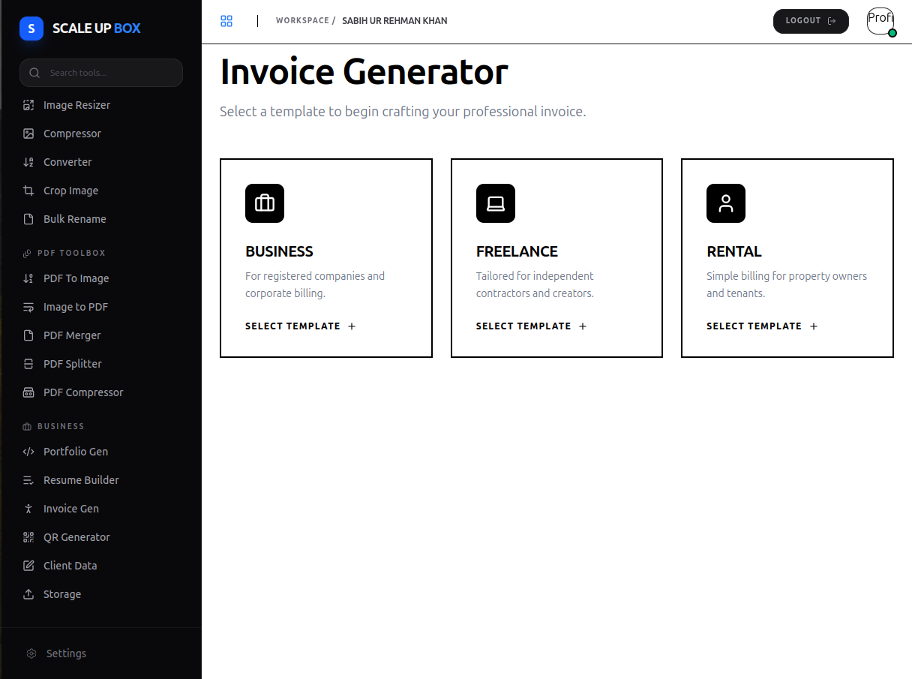
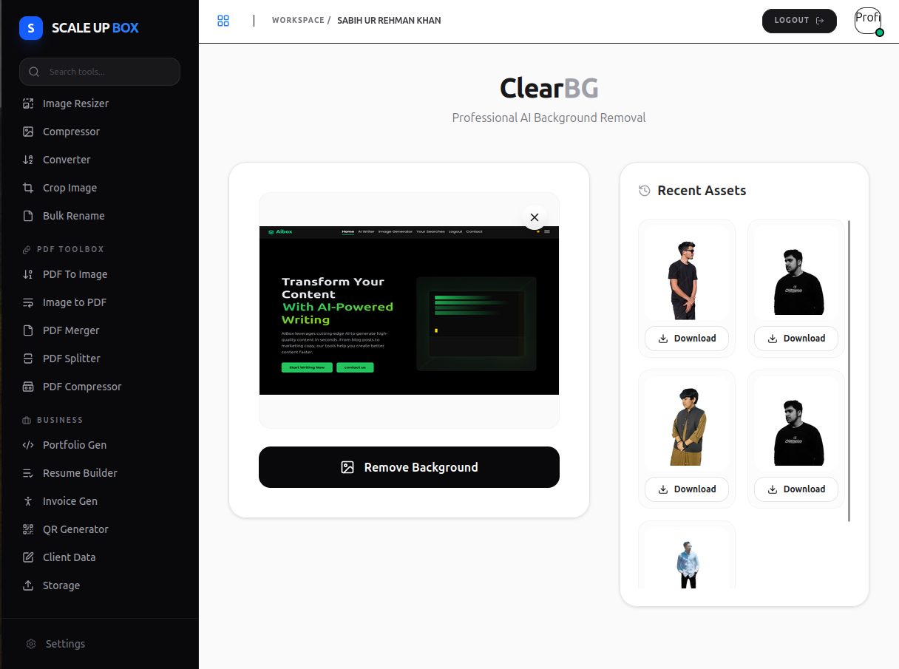

# 🚀 ScaleUBox


ScaleUBox is a **developer-focused AI SaaS platform** that provides tools for creators, developers, and businesses.

It integrates **AI services, cloud storage, authentication, portfolio generation, analytics, and client management** into a scalable backend architecture.

This system is designed to be **modular, secure, and production-ready**.

---
# 🌟 Project Highlights

ScaleUpBox includes **20+ powerful tools** for developers, freelancers, and creators.

### 🧰 Core Tools

| Tool | Description |
|-----|-------------|
| 🎨 Portfolio Builder | Generate developer portfolios instantly |
| 📄 Resume Builder | Create professional resumes |
| 🧾 Invoice Generator | Generate freelancer or business invoices |
| 💰 Expense Tracker | Track income and expenses |
| 🧠 AI Content Generator | Generate content using AI |
| 🖼 Background Remover | Remove image backgrounds |
| 🖼 Image Compressor | Compress large images |
| 🔁 Image Converter | Convert images to different formats |
| 📦 Image Storage | Store images with Cloudinary |
| 🧾 Client Data Manager | Save and manage client data |
| 📊 Dashboard Analytics | View project data and statistics |
| 🔐 Authentication System | Secure login/register |
| 📎 PDF Merger | Merge multiple PDFs |
| ✂️ PDF Splitter | Split large PDF files |
| 🗜 PDF Compressor | Compress large PDFs |
| 🖼 PDF → Image | Convert PDFs to images |
| 🖼 Image → PDF | Convert images to PDFs |
| 📏 Image Resizer | Resize images easily |
| ✂️ Image Cropper | Crop images |
| 🏷 Bulk Image Rename | Rename multiple images |
| 🔳 QR Code Generator | Generate QR codes |

**Total Tools Built:** `20+`

---

# 📸 Project Screenshots

## 🏠 Home Dashboard



---

## 🎨 Portfolio Generator



---

## 📄 Resume Builder



---

## 💰 Expense Tracker



---

## 🧾 Invoice Generator



---

## 🖼 Background Remover



---

## 📂 Client Data Storage


# 🏗 System Architecture

```
Frontend
   │
   ▼
API Gateway (Express Server)
   │
   ├── Authentication
   ├── AI Services
   ├── Portfolio Generator
   ├── Client Management
   ├── Image Processing
   └── Dashboard Analytics
   │
   ▼
Services Layer
   │
   ├── Gemini AI
   ├── Cloudinary
   ├── Redis Cache
   └── MongoDB Database
```

---

# 📁 Project Structure

```
ScaleUBox
│
├── README.md
├── index.html
│
├── backend
│   ├── .dockerignore
│   ├── .env
│   ├── .gitignore
│   ├── Dockerfile
│   ├── package.json
│   ├── package-lock.json
│   ├── server.js
│
│   ├── ai
│   │   └── gemenaiai.js
│
│   ├── cloudinary
│   │   └── cloudinary.js
│
│   ├── config
│   │   ├── db.js
│   │   └── redis.js
│
│   ├── controller
│   │   ├── Dashboardcontroller.js
│   │   ├── authcontroller.js
│   │   └── clientdatacrntroller.js
│
│   ├── models
│   │   ├── authmodel.js
│   │   ├── clientsinfomodel.js
│   │   └── portfoliomodel.js
│
│   ├── Routes
│   │   ├── AIroutes
│   │   │   └── airoute.js
│   │   │
│   │   ├── AuthRoutes
│   │   │   └── authroute.js
│   │   │
│   │   ├── DashboardRoutes
│   │   │   └── dashboardroutes.js
│   │   │
│   │   ├── clientsdataroute
│   │   │   └── clientroute.js
│   │   │
│   │   ├── contactus
│   │   │   └── contactus.js
│   │   │
│   │   ├── imgsaveddb
│   │   │   └── imgdbsave.js
│   │   │
│   │   ├── portfoliogenrator
│   │   │   └── portfolioroute.js
│   │   │
│   │   └── rmbg
│   │       └── removebg.js
│
│   └── middleware
│       ├── Authorization.js
│       ├── ratelimiting.js
│       └── googleResponse
│           └── verifygetpayload.js
```

---

# 🧰 Technology Stack

### Backend
- Node.js
- Express.js

### Database
- MongoDB

### Cache Layer
- Redis

### AI Integration
- Gemini AI API

### Media Storage
- Cloudinary

### Security
- JWT Authentication
- Rate Limiting
- Authorization Middleware
- Google Token Verification

### DevOps
- Docker

---

# 🔑 Environment Variables

Create a `.env` file inside `backend`.

Example:

```
PORT=5000

MONGO_URI=your_mongodb_connection

JWT_SECRET=your_secret_key

REDIS_URL=your_redis_url

GEMINI_API_KEY=your_gemini_api_key

CLOUDINARY_CLOUD_NAME=your_cloud_name
CLOUDINARY_API_KEY=your_api_key
CLOUDINARY_API_SECRET=your_api_secret
```

---

# ⚙️ Local Development

### 1 Install dependencies

```
cd backend
npm install
```

### 2 Start the server

```
node server.js
```

or

```
npm start
```

---

# 🐳 Docker Deployment

### Build Image

```
docker build -t scaleubox-backend .
```

### Run Container

```
docker run -p 5000:5000 scaleubox-backend
```

---

# 📡 API Modules

| Module | Purpose |
|------|------|
| Auth | Login and registration |
| Dashboard | System analytics |
| AI | AI content generation |
| Portfolio | Portfolio builder |
| Clients | Client data storage |
| Images | Save images in database |
| RemoveBG | Remove image backgrounds |
| Contact | Contact form system |

---

# 🔒 Security Features

ScaleUBox includes several production security systems:

- JWT authentication
- Protected API routes
- Rate limiting middleware
- Google OAuth verification
- Secure environment variables
- Middleware-based authorization

---

# 🚀 Future Improvements

Planned upgrades for ScaleUBox:

- Real-time AI chat
- Team collaboration
- AI image generator
- SaaS subscription system
- File storage system
- Web dashboard UI
- WebSocket support
- AI automation tools

---

# 📊 Current Platform Stats

| Category | Count |
|------|------|
| Feature Systems | 9 |
| API Modules | 8 |
| Controllers | 3 |
| Models | 3 |
| Middleware | 3 |
| AI Integrations | 1 |
| Cloud Integrations | 1 |

---

# 👨‍💻 Author

**Abdul Ahad Khan**

Full Stack Developer  
Building scalable web applications and AI tools.

---

# ⭐ Contributing

Contributions are welcome.

1 Fork the repository  
2 Create a new branch  
3 Commit your changes  
4 Submit a pull request

---

# 📜 License

This project is licensed under the MIT License.